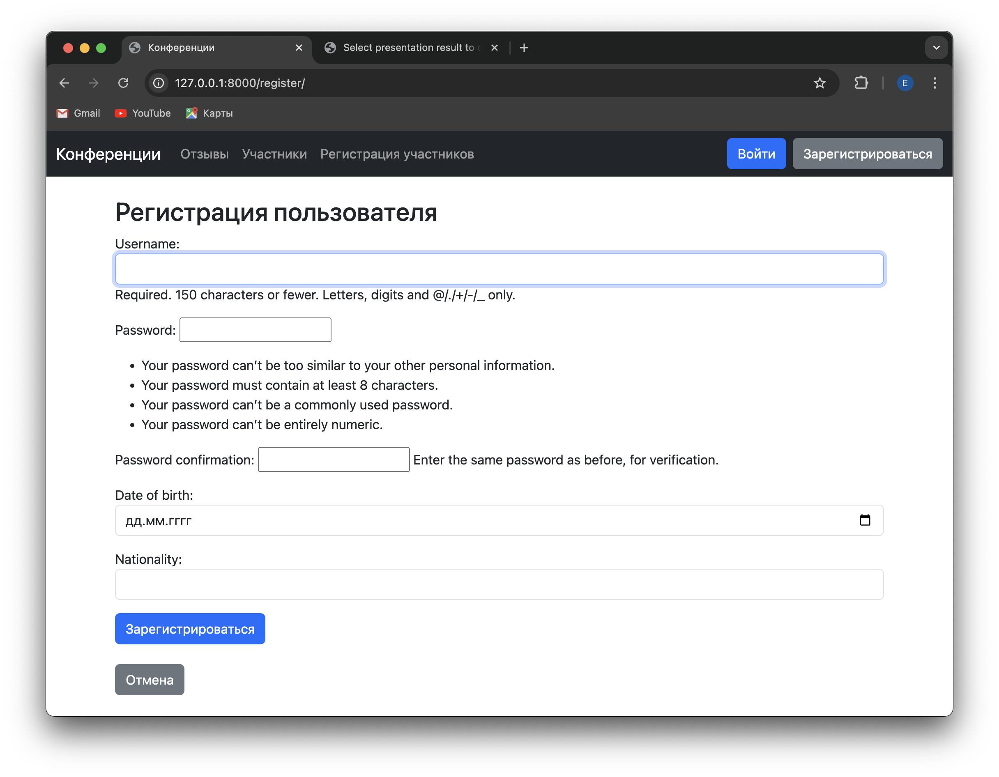
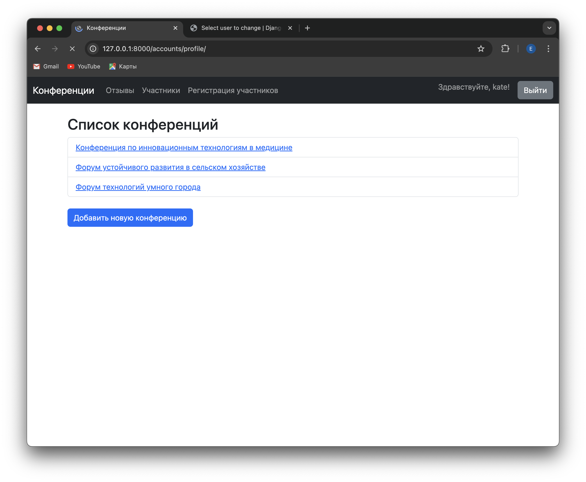
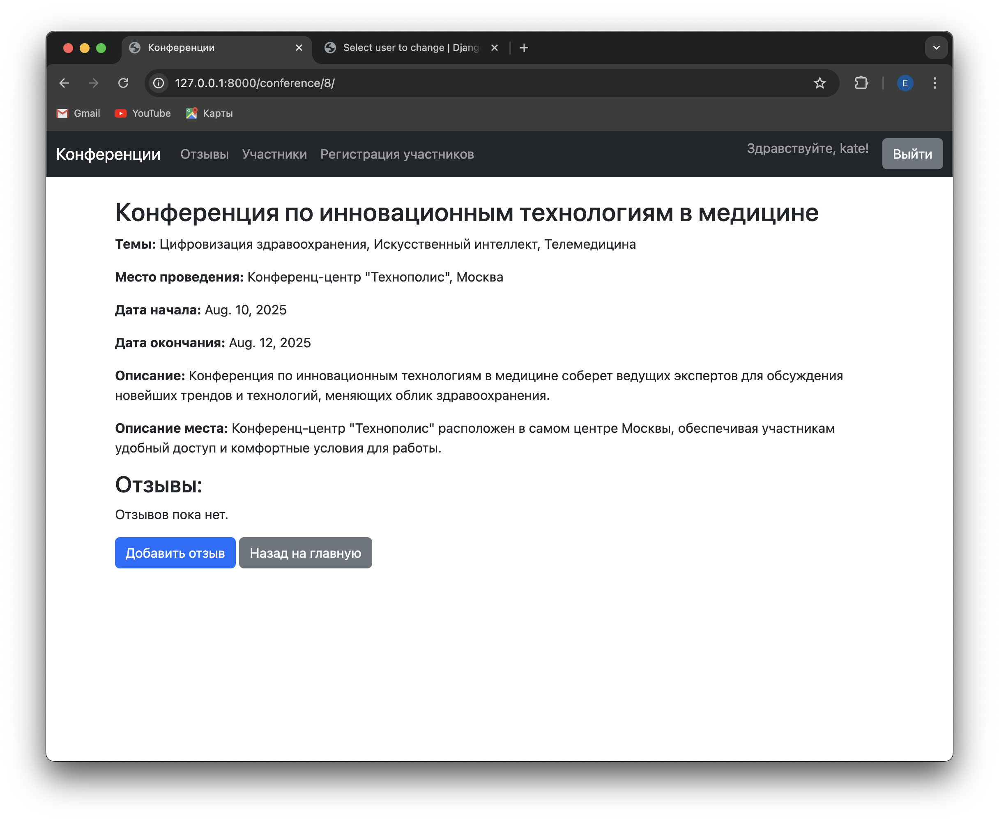
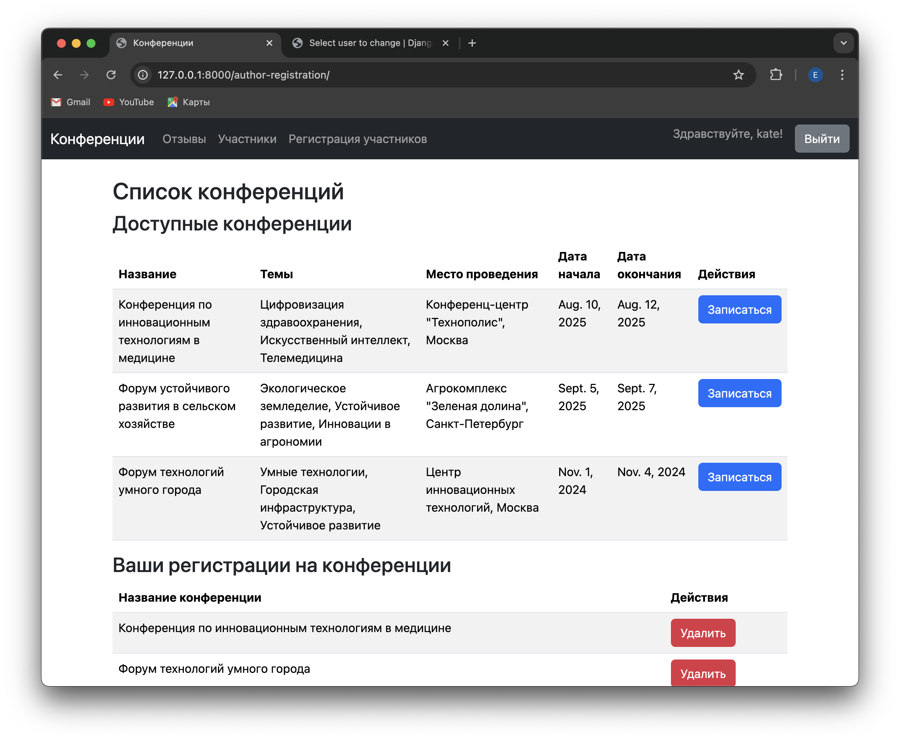
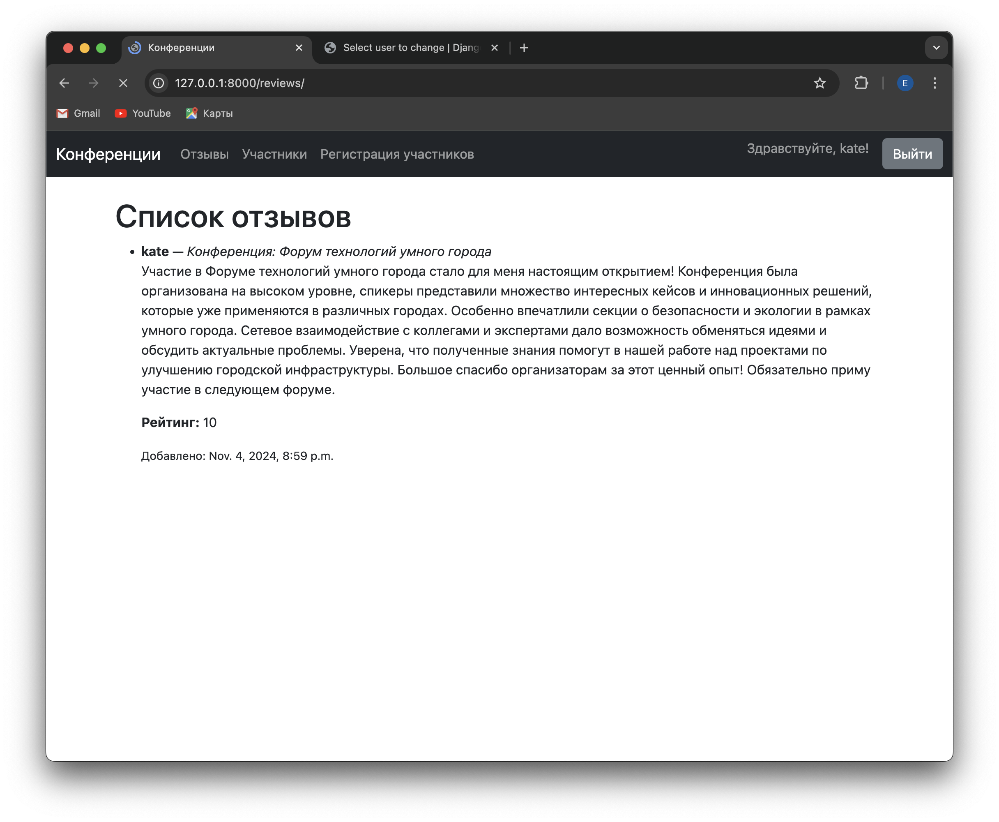
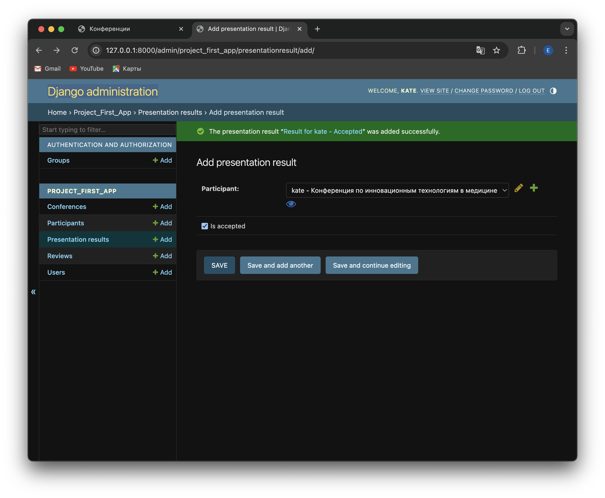
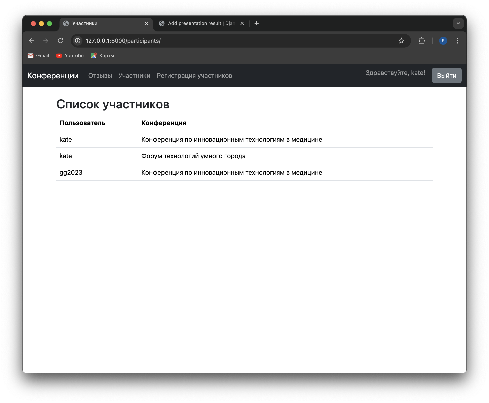

# Лабораторная работа №2 по дисциплине "WEB-программирование"

Вариант работы: 5

В данной лабораторной работе был реализован список научных конференций. Интерфейс описывает названия конференций, список тематик, место проведения,
период проведения, описание конференций, описание место проведения, условия участия.

Также был реализован весь необходимый функционал:

1. Регистрация новых пользователей.

Пользователь заходит на сайт и нажимает на ссылку «Зарегистрироваться». На странице регистрации пользователю предлагается заполнить форму, включающую в себя следующие поля:

* Имя пользователя;
* Пароль (он должен соответствовать определенным требованиям, описанным ниже);
* Подтверждение пароля;
* Дата рождения;
* Национальность (опциональное поле).

2. Просмотр конференций и регистрацию авторов для выступлений. Пользователь должен иметь возможность редактирования и удаления своих
регистраций.

Чтобы просмотреть конференции, нужно пройти на страницу "Конференции".

Нажав на конференцию, можно оставить отзыв и узнать подробности о ней.

Чтобы зарегистрировать на конференцию или удалить регистрацию, нужно войти в профиль и перейти на страницу "Регистрация участников".

3. Написание отзывов к конференциям. При добавлении комментариев должны сохраняться даты конференции, текст комментария, рейтинг (1-10),
информация о комментаторе.

Как говорилось ранее, оставить отзыв на конференции можно, перейдя на страницу необходимой конференции.
Все отзывы хранятся на странице "Отзывы".

4. Администратор должен иметь возможность указания результатов выступления (рекомендован к публикации или нет) средствами Django-admin.

Указать результаты выступления можно в разделе "Presentation results"

5. В клиентской части должна формироваться таблица, отображающая всех
участников по конференциям.

Всех участников конференции можно просмотреть на странице "Участники"

**Описание интерфейса**

Интерфейс описывает следующие аспекты конференций:

* Названия конференций
* Список тематик
* Место проведения
* Период проведения
* Описание конференций
* Описание места проведения

Регистрация новых пользователей:

* Пользователи могут зарегистрироваться на сайте, предоставив необходимые данные.
* Используется форма NewUserForm для создания нового пользователя.

Просмотр конференций и регистрация авторов для выступлений:

* Пользователи могут просматривать список конференций.
* Авторы могут регистрироваться для выступлений на конференциях.
* Пользователи могут редактировать и удалять свои регистрации.

Написание отзывов к конференциям:

* Пользователи могут добавлять отзывы к конференциям.
* При добавлении отзыва сохраняются дата конференции, текст отзыва, рейтинг (1-10) и информация о комментаторе.

Формирование таблицы участников по конференциям:

* В клиентской части формируется таблица, отображающая всех участников по конференциям.

**Модели:**

* User: Модель пользователя.
* Conference: Модель конференции.
* Review: Модель отзыва.
* Participant: Модель участника.

**Формы:**

* NewUserForm: Форма для регистрации новых пользователей.
* ReviewForm: Форма для добавления отзывов.
* ParticipantForm: Форма для регистрации участников.
* ConferenceForm: Форма для создания и редактирования конференций.
* CustomAuthenticationForm: Форма для аутентификации пользователей.

**Представления (Views):**

* CustomLoginView: Представление для входа пользователей.
* HomeView: Представление главной страницы с отображением конференций.
* RegisterView: Представление для регистрации новых пользователей.
* AddReviewView: Представление для добавления отзывов.
* ParticipantListView: Представление для отображения списка участников.
* ConferenceDetailView: Представление для отображения деталей конференции.
* NewConferenceView: Представление для создания новой конференции.
* EditConferenceView: Представление для редактирования конференции.
* DeleteConferenceView: Представление для удаления конференции.
* ParticipantDetailView: Представление для отображения деталей участника.
* ReviewListView: Представление для отображения списка отзывов.
* AuthorRegistrationView: Представление для регистрации авторов на конференции.
* ParticipantUpdateView: Представление для редактирования регистрации участника.
* ParticipantDeleteView: Представление для удаления регистрации участника.