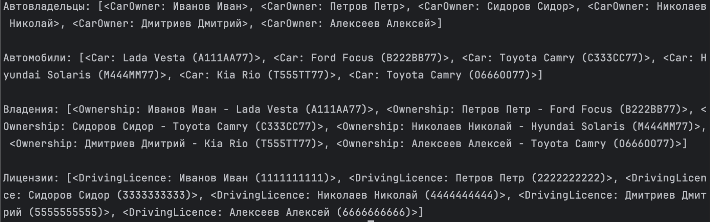
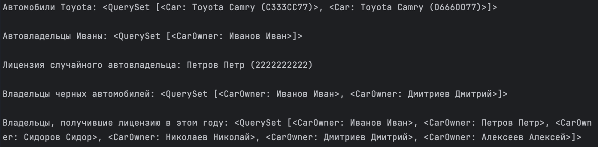
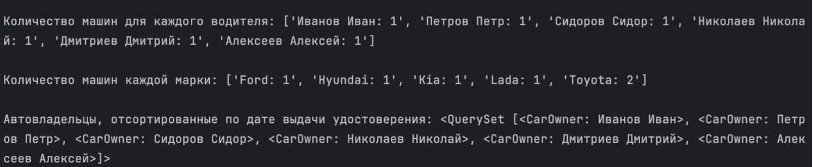

Модели

```
from django.db import models


class CarOwner(models.Model):
    class Meta:
        db_table = "car_owner"
        verbose_name = "автовладелец"
        verbose_name_plural = "автовладельцы"

    last_name = models.CharField(max_length=30, verbose_name="Фамилия")
    first_name = models.CharField(max_length=30, verbose_name="Имя")
    birth_date = models.DateTimeField(blank=True, null=True, verbose_name="Дата рождения")

    @property
    def full_name(self) -> str:
        return f"{self.last_name} {self.first_name}"

    full_name.fget.short_description = "Фамилия и Имя"

    def __str__(self):
        return self.full_name


class Car(models.Model):
    class Meta:
        db_table = "car"
        verbose_name = "автомобиль"
        verbose_name_plural = "автомобили"

    number = models.CharField(max_length=15, verbose_name="Государственный номер")
    brand = models.CharField(max_length=20, verbose_name="Марка")
    model = models.CharField(max_length=20, verbose_name="Модель")
    color = models.CharField(max_length=30, verbose_name="Цвет")

    def __str__(self):
        return f"{self.brand} {self.model} ({self.number})"


class Ownership(models.Model):
    class Meta:
        db_table = "ownership"
        verbose_name = "владение"
        verbose_name_plural = "владения"

    owner = models.ForeignKey(
        CarOwner, blank=True, null=True, on_delete=models.CASCADE, verbose_name="Владелец", related_name="ownerships"
    )
    car = models.ForeignKey(
        Car, blank=True, null=True, on_delete=models.CASCADE, verbose_name="Автомобиль", related_name="ownerships"
    )
    start_date = models.DateTimeField(verbose_name="Дата начала")
    end_date = models.DateTimeField(blank=True, null=True, verbose_name="Дата конца")

    def __str__(self):
        return f"{self.owner} - {self.car}"


class DrivingLicence(models.Model):
    class Meta:
        db_table = "driving_licence"
        verbose_name = "водительское удостоверение"
        verbose_name_plural = "водительские удостоверения"

    owner = models.ForeignKey(CarOwner, on_delete=models.CASCADE, verbose_name="Владелец", related_name="licences")
    number = models.CharField(max_length=10, verbose_name="Номер удостоверения")
    type = models.CharField(max_length=10, verbose_name="Тип")
    issue_date = models.DateTimeField(verbose_name="Дата выдачи")

    def __str__(self):
        return f"{self.owner} ({self.number})"

```

Напишите запрос на создание 6-7 новых автовладельцев и 5-6 автомобилей, каждому автовладельцу назначьте удостоверение и от 1 до 3 автомобилей.

Задание можете выполнить либо в интерактивном режиме интерпретатора, либо в отдельном python-файле.

Результатом должны стать запросы и отображение созданных объектов.

```
import os

import django

os.environ.setdefault("DJANGO_SETTINGS_MODULE", "simple_drf_project.settings")
django.setup()

from django.utils import timezone
from project_first_app.models import CarOwner, Car, Ownership, DrivingLicence

owners = CarOwner.objects.bulk_create(
    [
        CarOwner(last_name="Иванов", first_name="Иван", birth_date=timezone.now()),
        CarOwner(last_name="Петров", first_name="Петр", birth_date=timezone.now()),
        CarOwner(last_name="Сидоров", first_name="Сидор", birth_date=timezone.now()),
        CarOwner(last_name="Николаев", first_name="Николай", birth_date=timezone.now()),
        CarOwner(last_name="Дмитриев", first_name="Дмитрий", birth_date=timezone.now()),
        CarOwner(last_name="Алексеев", first_name="Алексей", birth_date=timezone.now()),
    ]
)

cars = Car.objects.bulk_create(
    [
        Car(number="А111АА77", brand="Lada", model="Vesta", color="черный"),
        Car(number="В222ВВ77", brand="Ford", model="Focus", color="синий"),
        Car(number="С333СС77", brand="Toyota", model="Camry", color="белый"),
        Car(number="М444ММ77", brand="Hyundai", model="Solaris", color="серый"),
        Car(number="Т555ТТ77", brand="Kia", model="Rio", color="черный"),
        Car(number="О666ОО77", brand="Toyota", model="Camry", color="зеленый"),
    ]
)

ownerships = Ownership.objects.bulk_create(
    [Ownership(owner=owners[i], car=cars[i], start_date=timezone.now()) for i in range(6)]
)

licences = DrivingLicence.objects.bulk_create(
    [DrivingLicence(owner=owners[i], number=str(i + 1) * 10, type="B", issue_date=timezone.now()) for i in range(6)]
)

print(f"Автовладельцы: {owners}", f"Автомобили: {cars}", f"Владения: {ownerships}", f"Лицензии: {licences}", sep="\n\n")
```

Укажем файл настроек проекта в виртуальном окружении и запустим django.setup(), чтобы сконфигурировать настройки и иметь возможность запускать этот файл независимо.

Только после этого мы можем импортировать и использовать модели.

С помощью метода bulk_create создадим сразу несколько объектов одним запросом.

Создадим таким образом 6 автовладельцев и 6 машин. Затем так же с помощью bulk_create создадим 6 автовладений и 6 лицензий. Список объектов будем создавать с помощью list comprehension.




По созданным в задании 1 данным написать следующие запросы на фильтрацию:

Где это необходимо, добавьте related_name к полям модели;
Выведете все машины марки “Toyota” (или любой другой марки, которая у вас есть);
Найти всех водителей с именем “Олег” (или любым другим именем на ваше усмотрение);
Взяв любого случайного владельца получить его id, и по этому id получить экземпляр удостоверения в виде объекта модели (можно в 2 запроса);
Вывести всех владельцев красных машин (или любого другого цвета, который у вас присутствует);
Найти всех владельцев, чей год владения машиной начинается с 2010 (или любой другой год, который присутствует у вас в базе).

```
import os

import django

os.environ.setdefault("DJANGO_SETTINGS_MODULE", "simple_drf_project.settings")
django.setup()

from django.utils import timezone
from project_first_app.models import CarOwner, Car, DrivingLicence


toyota_cars = Car.objects.filter(brand="Toyota").all()

ivan_owners = CarOwner.objects.filter(first_name="Иван").all()

random_owner_id = CarOwner.objects.order_by("?").values_list("id", flat=True).first()
random_owner_licence = DrivingLicence.objects.get(owner_id=random_owner_id)

black_car_owners = CarOwner.objects.filter(ownerships__car__color="черный").all()

this_year_owners = CarOwner.objects.filter(licences__issue_date__year=timezone.now().year).all()


print(
    f"Автомобили Toyota: {toyota_cars}",
    f"Автовладельцы Иваны: {ivan_owners}",
    f"Лицензия случайного автовладельца: {random_owner_licence}",
    f"Владельцы черных автомобилей: {black_car_owners}",
    f"Владельцы, получившие лицензию в этом году: {this_year_owners}",
    sep="\n\n",
)
```


Укажем файл настроек проекта в виртуальном окружении и запустим django.setup(), чтобы сконфигурировать настройки и иметь возможность запускать этот файл независимо.

Только после этого мы можем импортировать и использовать модели.

Машины марки Toyota и водителей с именем Иван получим, используя базовый фильтр по значению поля.

Случайного автовладельца получим, используя аргумент "?" в методе order_by. Затем с помощью values_list("id", flat=True) получим список значений "id", а не список объектов/словарей.
Используя метод first получим только первого значение в этом списке.

Полученное значение затем используем в фильтре для водительских удостоверений.

Список автовладельцев чёрного цвета получим, используя фильтр по внешним ключам (через разделитель __) в модели CarOwner. Сначала перейдём по ключу ownership к автовладениям, от него по ключу car перейдём к автомобилям и здесь уже используем фильтр по цвету.

Схожим образом получим автовладельцев, получивших лицензию в этом году.

Затем выведем все полученные объекты и получим следующее:



Необходимо реализовать следующие запросы c применением описанных методов:

Вывод даты выдачи самого старшего водительского удостоверения;
Укажите самую позднюю дату владения машиной, имеющую какую-то из существующих моделей в вашей базе;
Выведите количество машин для каждого водителя;
Подсчитайте количество машин каждой марки;
Отсортируйте всех автовладельцев по дате выдачи удостоверения.

```
import os

import django
from django.db.models import Min, Max, Count

os.environ.setdefault("DJANGO_SETTINGS_MODULE", "simple_drf_project.settings")
django.setup()

from project_first_app.models import CarOwner, Car, Ownership, DrivingLicence

oldest_licence = DrivingLicence.objects.aggregate(max_issue_date=Min("issue_date"))["max_issue_date"]

newest_ownership = Ownership.objects.aggregate(max_start_date=Max("start_date"))["max_start_date"]

ownerships_counts = CarOwner.objects.annotate(count=Count("ownerships"))
ownerships_counts_str = [f"{owner.full_name}: {owner.count}" for owner in ownerships_counts]

cars_count_by_brands = Car.objects.values("brand").annotate(count=Count("id"))
cars_count_by_brands_str = [f"{car['brand']}: {car['count']}" for car in cars_count_by_brands]

sorted_owners = CarOwner.objects.order_by("ownerships__start_date").all()

print(
    f"Дата самого старшего удостоверения: {oldest_licence}",
    f"Самая поздняя дата авто владения: {newest_ownership}",
    f"Количество машин для каждого водителя: {ownerships_counts_str}",
    f"Количество машин каждой марки: {cars_count_by_brands_str}",
    f"Автовладельцы, отсортированные по дате выдачи удостоверения: {sorted_owners}",
    sep="\n\n",
)
```

Укажем файл настроек проекта в виртуальном окружении и запустим django.setup(), чтобы сконфигурировать настройки и иметь возможность запускать этот файл независимо.

Только после этого мы можем импортировать и использовать модели.

Самое старшее водительское удостоверение получим с помощью метода aggregate и функции Min, которую используем для поля даты выдачи.

Самую позднюю дату владения машиной получим аналогичным образом, но используя функцию Max по дате начала владения.

Чтобы вывести количество машин для каждого владельца, сначала создадим новое поле count с помощью метода annotate и функции Count, а затем проитерируемся по полученнуму запросу и возьмём от каждого объекта фамилию, имя и количество машин.

Количество машин каждой марки подсчитаем схожим образом, но перед применением метода annotate сначала вызовем метод values, с помощью которого получим марки машин.

Отсортируем всех владельцев по дате выдачи удостоверения, используя метод order_by и поле start_date, к которому обратимся через внешний ключ ownerships в модели автовладельцев.

Затем выведем все полученные объекты и получим следующее:

