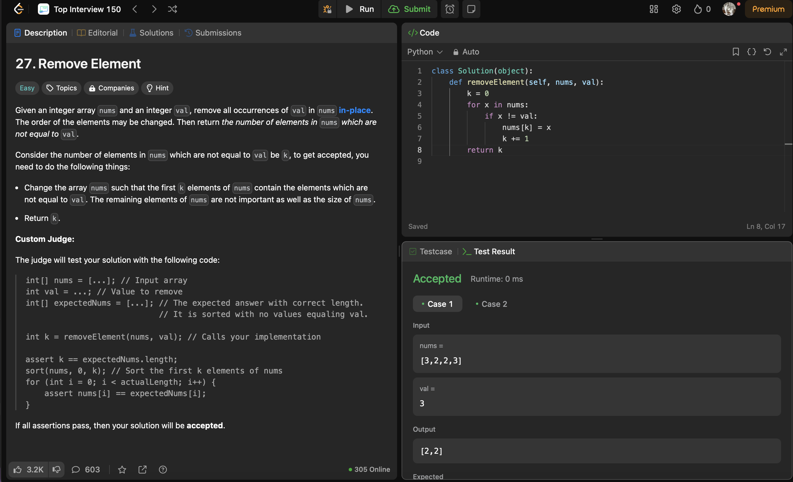
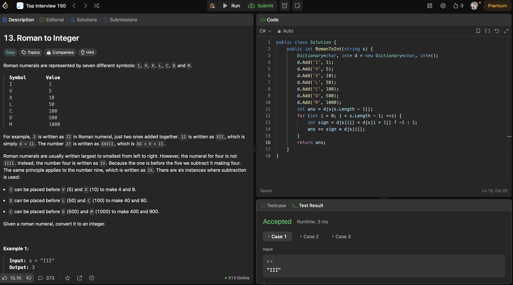
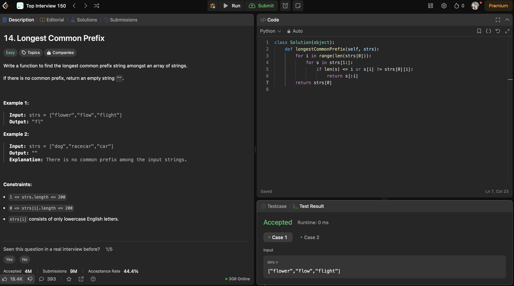
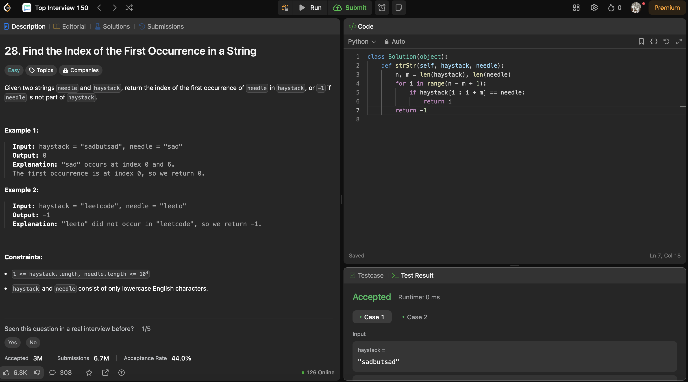
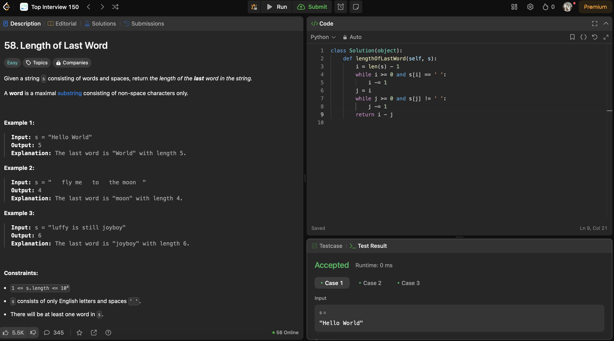
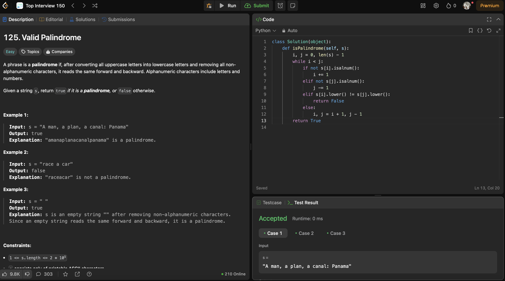
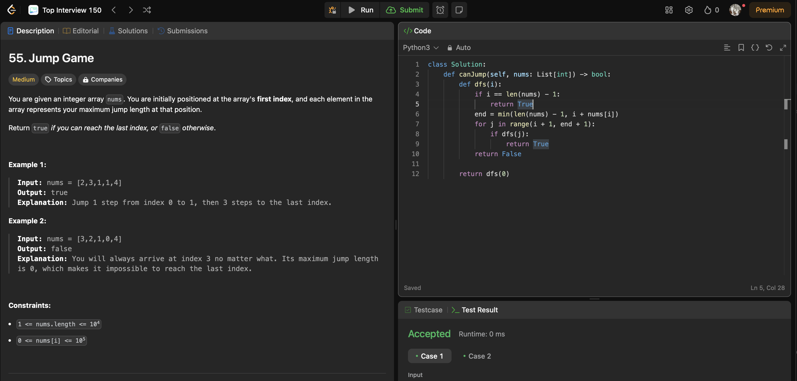
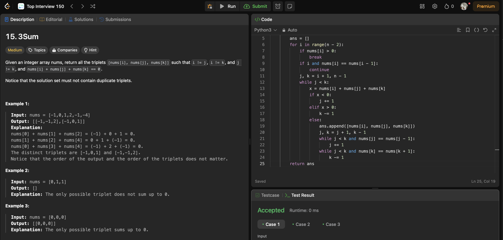
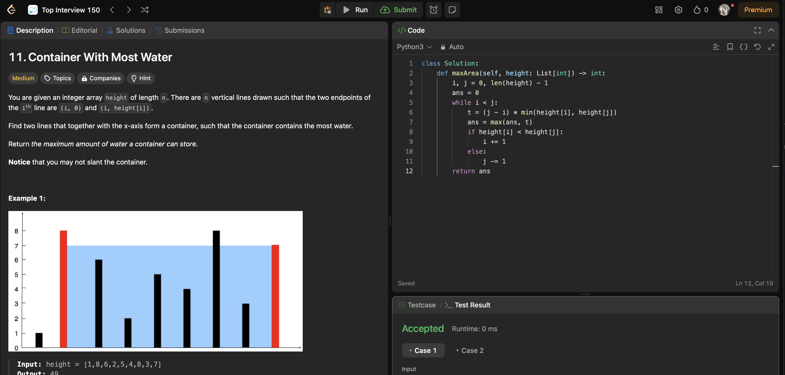

# Отработка долгов за пропущенные недели



Задача 27.

Given an integer array nums and an integer val, remove all occurrences of val in nums in-place. The order of the elements may be changed. Then return the number of elements in nums which are not equal to val.

Consider the number of elements in nums which are not equal to val be k, to get accepted, you need to do the following things:

Change the array nums such that the first k elements of nums contain the elements which are not equal to val. The remaining elements of nums are not important as well as the size of nums.
Return k.

```
class Solution(object):
    def removeElement(self, nums, val):
        k = 0
        for x in nums:
            if x != val:
                nums[k] = x
                k += 1
        return k
```



Задача 13.

Roman numerals are represented by seven different symbols: I, V, X, L, C, D and M.

Symbol       Value
I             1
V             5
X             10
L             50
C             100
D             500
M             1000
For example, 2 is written as II in Roman numeral, just two ones added together. 12 is written as XII, which is simply X + II. The number 27 is written as XXVII, which is XX + V + II.

Roman numerals are usually written largest to smallest from left to right. However, the numeral for four is not IIII. Instead, the number four is written as IV. Because the one is before the five we subtract it making four. The same principle applies to the number nine, which is written as IX. There are six instances where subtraction is used:

I can be placed before V (5) and X (10) to make 4 and 9. 
X can be placed before L (50) and C (100) to make 40 and 90. 
C can be placed before D (500) and M (1000) to make 400 and 900.
Given a roman numeral, convert it to an integer.

```
public class Solution {
    public int RomanToInt(string s) {
        Dictionary<char, int> d = new Dictionary<char, int>();
        d.Add('I', 1);
        d.Add('V', 5);
        d.Add('X', 10);
        d.Add('L', 50);
        d.Add('C', 100);
        d.Add('D', 500);
        d.Add('M', 1000);
        int ans = d[s[s.Length - 1]];
        for (int i = 0; i < s.Length - 1; ++i) {
            int sign = d[s[i]] < d[s[i + 1]] ? -1 : 1;
            ans += sign * d[s[i]];
        }
        return ans;
    }
}
```



Задача 14.

Write a function to find the longest common prefix string amongst an array of strings.

If there is no common prefix, return an empty string "".

```
class Solution(object):
    def longestCommonPrefix(self, strs):
        for i in range(len(strs[0])):
            for s in strs[1:]:
                if len(s) <= i or s[i] != strs[0][i]:
                    return s[:i]
        return strs[0]
```        



Задача 28.

Given two strings needle and haystack, return the index of the first occurrence of needle in haystack, or -1 if needle is not part of haystack.

```
class Solution(object):
    def strStr(self, haystack, needle):
        n, m = len(haystack), len(needle)
        for i in range(n - m + 1):
            if haystack[i : i + m] == needle:
                return i
        return -1
```



Задача 58.

Given a string s consisting of words and spaces, return the length of the last word in the string.

A word is a maximal substring consisting of non-space characters only.

```
class Solution(object):
    def lengthOfLastWord(self, s):
        i = len(s) - 1
        while i >= 0 and s[i] == ' ':
            i -= 1
        j = i
        while j >= 0 and s[j] != ' ':
            j -= 1
        return i - j
```



Задача 125.

A phrase is a palindrome if, after converting all uppercase letters into lowercase letters and removing all non-alphanumeric characters, it reads the same forward and backward. Alphanumeric characters include letters and numbers.

Given a string s, return true if it is a palindrome, or false otherwise.

```
class Solution(object):
    def isPalindrome(self, s):
        i, j = 0, len(s) - 1
        while i < j:
            if not s[i].isalnum():
                i += 1
            elif not s[j].isalnum():
                j -= 1
            elif s[i].lower() != s[j].lower():
                return False
            else:
                i, j = i + 1, j - 1
        return True
```


Задача 55.

You are given an integer array nums. You are initially positioned at the array's first index, and each element in the array represents your maximum jump length at that position.

Return true if you can reach the last index, or false otherwise.

 

Example 1:

Input: nums = [2,3,1,1,4]
Output: true
Explanation: Jump 1 step from index 0 to 1, then 3 steps to the last index.
Example 2:

Input: nums = [3,2,1,0,4]
Output: false
Explanation: You will always arrive at index 3 no matter what. Its maximum jump length is 0, which makes it impossible to reach the last index.
 

Constraints:

1 <= nums.length <= 104
0 <= nums[i] <= 105

```
class Solution:
    def canJump(self, nums: List[int]) -> bool:
        def dfs(i):
            if i == len(nums) - 1:
                return True
            end = min(len(nums) - 1, i + nums[i])
            for j in range(i + 1, end + 1):
                if dfs(j):
                    return True
            return False

        return dfs(0)
```


Задача 15.

Given an integer array nums, return all the triplets [nums[i], nums[j], nums[k]] such that i != j, i != k, and j != k, and nums[i] + nums[j] + nums[k] == 0.

Notice that the solution set must not contain duplicate triplets.

 

Example 1:

Input: nums = [-1,0,1,2,-1,-4]
Output: [[-1,-1,2],[-1,0,1]]
Explanation: 
nums[0] + nums[1] + nums[2] = (-1) + 0 + 1 = 0.
nums[1] + nums[2] + nums[4] = 0 + 1 + (-1) = 0.
nums[0] + nums[3] + nums[4] = (-1) + 2 + (-1) = 0.
The distinct triplets are [-1,0,1] and [-1,-1,2].
Notice that the order of the output and the order of the triplets does not matter.
Example 2:

Input: nums = [0,1,1]
Output: []
Explanation: The only possible triplet does not sum up to 0.
Example 3:

Input: nums = [0,0,0]
Output: [[0,0,0]]
Explanation: The only possible triplet sums up to 0.

```
class Solution:
    def threeSum(self, nums: List[int]) -> List[List[int]]:
        nums.sort()
        n = len(nums)
        ans = []
        for i in range(n - 2):
            if nums[i] > 0:
                break
            if i and nums[i] == nums[i - 1]:
                continue
            j, k = i + 1, n - 1
            while j < k:
                x = nums[i] + nums[j] + nums[k]
                if x < 0:
                    j += 1
                elif x > 0:
                    k -= 1
                else:
                    ans.append([nums[i], nums[j], nums[k]])
                    j, k = j + 1, k - 1
                    while j < k and nums[j] == nums[j - 1]:
                        j += 1
                    while j < k and nums[k] == nums[k + 1]:
                        k -= 1
        return ans
```


Задача 11.

You are given an integer array height of length n. There are n vertical lines drawn such that the two endpoints of the ith line are (i, 0) and (i, height[i]).

Find two lines that together with the x-axis form a container, such that the container contains the most water.

Return the maximum amount of water a container can store.

Notice that you may not slant the container.

```
class Solution:
    def maxArea(self, height: List[int]) -> int:
        i, j = 0, len(height) - 1
        ans = 0
        while i < j:
            t = (j - i) * min(height[i], height[j])
            ans = max(ans, t)
            if height[i] < height[j]:
                i += 1
            else:
                j -= 1
        return ans
```