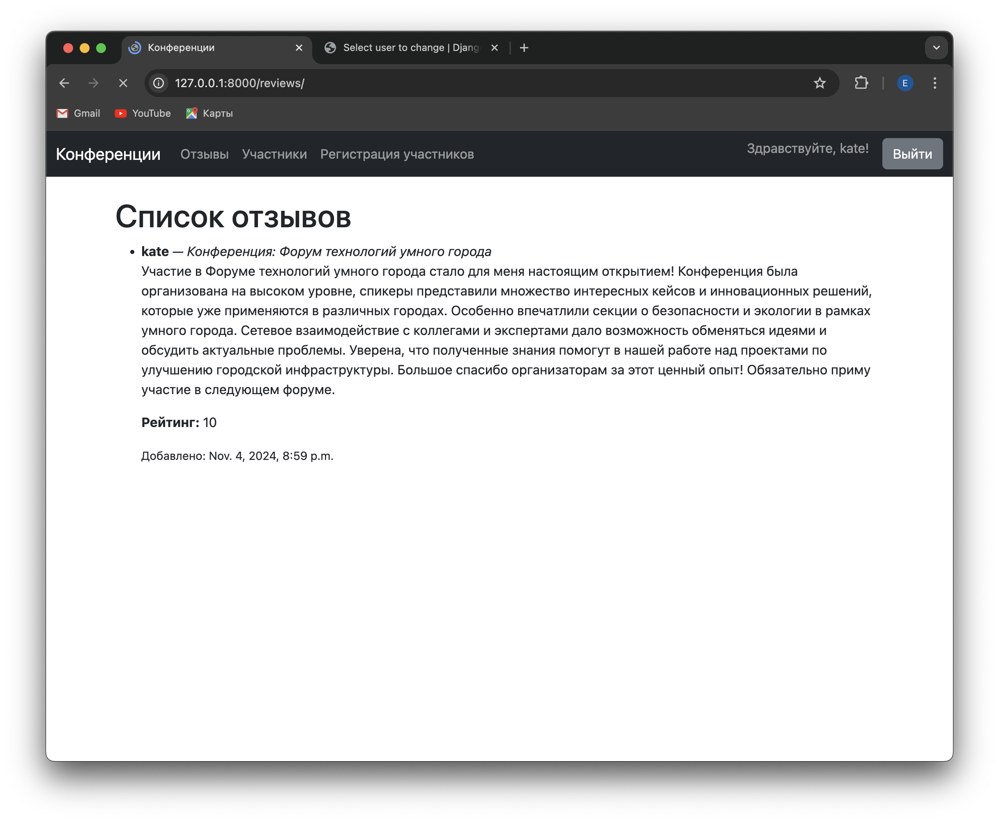

# Лабораторная работа №2 по дисциплине "WEB-программирование"

Вариант работы: 5

В данной лабораторной работе был реализован список научных конференций. Интерфейс описывает названия конференций, список тематик, место проведения,
период проведения, описание конференций, описание место проведения, условия участия.

Также был реализован весь необходимый функционал:

1. Регистрация новых пользователей.

Пользователь заходит на сайт и нажимает на ссылку «Зарегистрироваться». На странице регистрации пользователю предлагается заполнить форму, включающую в себя следующие поля:

* Имя пользователя;
* Пароль (он должен соответствовать определенным требованиям, описанным ниже);
* Подтверждение пароля;
* Дата рождения;
* Национальность (опциональное поле).

2. Просмотр конференций и регистрацию авторов для выступлений. Пользователь должен иметь возможность редактирования и удаления своих
регистраций.

Чтобы просмотреть конференции, нужно пройти на страницу "Конференции".

Нажав на конференцию, можно оставить отзыв и узнать подробности о ней.

Чтобы зарегистрировать на конференцию или удалить регистрацию, нужно войти в профиль и перейти на страницу "Регистрация участников".

3. Написание отзывов к конференциям. При добавлении комментариев должны сохраняться даты конференции, текст комментария, рейтинг (1-10),
информация о комментаторе.

Как говорилось ранее, оставить отзыв на конференции можно, перейдя на страницу необходимой конференции.
Все отзывы хранятся на странице "Отзывы".

4. Администратор должен иметь возможность указания результатов выступления (рекомендован к публикации или нет) средствами Django-admin.

Указать результаты выступления можно в разделе "Presentation results"

5. В клиентской части должна формироваться таблица, отображающая всех
участников по конференциям.

Всех участников конференции можно просмотреть на странице "Участники"

